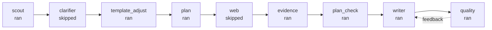

# Report Workflow

## Stages
1. scout: ran
2. clarifier: skipped (no_questions)
3. template_adjust: ran
4. plan: ran
5. web: skipped (policy)
6. evidence: ran
7. plan_check: ran
8. writer: ran
9. quality: ran (iterations=1/4)

## Timeline

1. [2026-02-25T10:15:00] scout: ran
2. [2026-02-25T10:15:00] clarifier: skipped (no_questions)
3. [2026-02-25T10:15:46] template_adjust: ran
4. [2026-02-25T10:16:03] plan: ran
5. [2026-02-25T10:16:28] web: skipped (policy)
6. [2026-02-25T10:17:13] evidence: ran
7. [2026-02-25T10:18:41] plan_check: ran
8. [2026-02-25T10:21:17] writer: ran
9. [2026-02-25T10:24:23] quality: ran (iterations=1/4)

## Artifacts
### scout
- Scout notes: ./report_notes/scout_notes.md

### template_adjust
- Template adjustment: ./report_notes/template_adjustment.md

### plan
- Plan update: ./report_notes/report_plan.md

### evidence
- Evidence notes: ./report_notes/evidence_notes.md
- Source triage: ./report_notes/source_triage.md
- Source index: ./report_notes/source_index.jsonl
- Claim map: ./report_notes/claim_map.md
- Claim-evidence map: ./report_notes/claim_evidence_map.md
- Claim-evidence map (json): ./report_notes/claim_evidence_map.json
- Gap report: ./report_notes/gap_finder.md

### quality
- Quality evaluations: ./report_notes/quality_evals.jsonl
- Quality pairwise: ./report_notes/quality_pairwise.jsonl

## Diagram

## Outputs
- Report overview: ./report/run_overview_report_full_iter016_gpt52_ko_deep_world.md
- Report meta: ./report_notes/report_meta.json
- Report prompt copy: ./instruction/report_prompt_report_full_iter016_gpt52_ko_deep_world.txt
- Template summary: ./report_notes/report_template.txt
