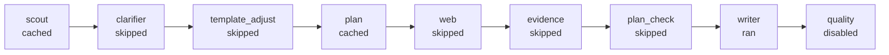

# Report Workflow

## Stages
1. scout: cached
2. clarifier: skipped (no_questions)
3. template_adjust: skipped (depth=brief)
4. plan: cached
5. web: skipped (policy)
6. evidence: skipped (depth=brief)
7. plan_check: skipped (missing_evidence)
8. writer: ran
9. quality: disabled

## Timeline

1. [2026-02-25T06:21:06] template_adjust: skipped (depth=brief)
2. [2026-02-25T06:21:08] scout: cached
3. [2026-02-25T06:21:08] clarifier: skipped (no_questions)
4. [2026-02-25T06:21:09] plan: cached
5. [2026-02-25T06:21:09] web: skipped (policy)
6. [2026-02-25T06:21:09] plan_check: skipped (missing_evidence)
7. [2026-02-25T06:21:09] evidence: skipped (depth=brief)
8. [2026-02-25T06:22:16] writer: ran

## Artifacts
### scout
- Scout notes: ./report_notes/scout_notes.md

### plan
- Plan update: ./report_notes/report_plan.md

### evidence
- Evidence notes: ./report_notes/evidence_notes.md
- Source triage: ./report_notes/source_triage.md
- Source index: ./report_notes/source_index.jsonl
- Claim map: ./report_notes/claim_map.md
- Claim-evidence map: ./report_notes/claim_evidence_map.md
- Claim-evidence map (json): ./report_notes/claim_evidence_map.json
- Gap report: ./report_notes/gap_finder.md

### quality
- Quality evaluations: ./report_notes/quality_evals.jsonl
- Quality pairwise: ./report_notes/quality_pairwise.jsonl

## Diagram

## Outputs
- Report overview: ./report/run_overview_report_full_iter004_gpt5nano_leader.md
- Report meta: ./report_notes/report_meta.json
- Report prompt copy: ./instruction/report_prompt_report_full_iter004_gpt5nano_leader.txt
- Template summary: ./report_notes/report_template.txt
